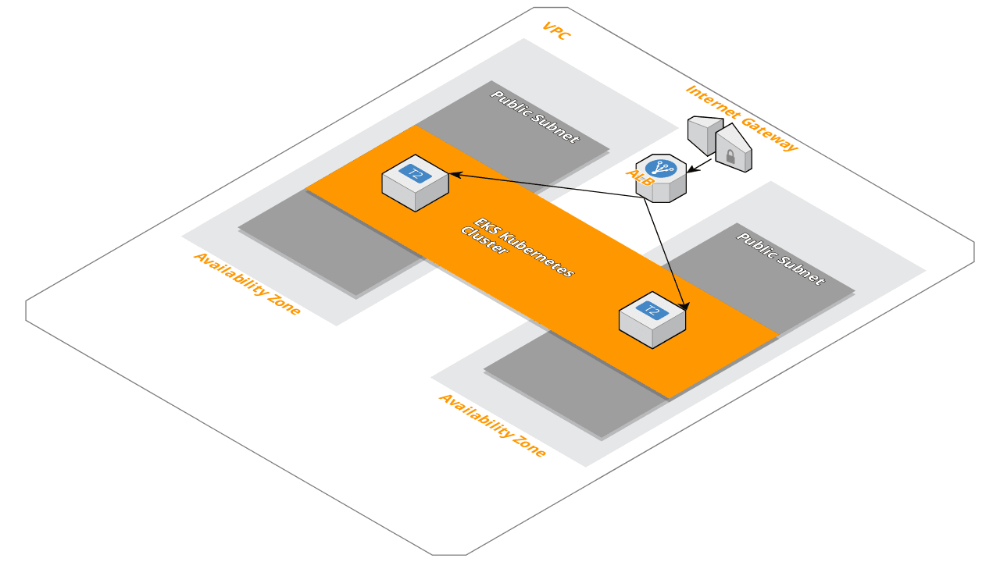

# AWS EKS Kubernetes cluster using AWS CloudFormation
Quikly spin up an AWS EKS Kubernetes cluster using AWS CloudFormation.

[](architecture.png)

Infrastructure as Code (IaC) is the recommended way to manage the cloud infrastructure that your
application runs on.  IaC allows you to incrementailly add/remove infrastructure as your application changes.

IaC really shines when you need to spin up a new environment.  Lets say you get a huge customer who wants
to be on their own instance.  You can be up in running withing the hour.

This project contains 3 CloudFormation scripts.  They must be created in order because they depend on each other:
1.) VPC
2.) Kubernetes Cluster (EKS)
3.) Worker Nodes (EC2)

# Prerequisites
- [AWS Account](https://aws.amazon.com/)
- [EC2 Key Pair](https://console.aws.amazon.com/ec2/v2/home)
- [cim.sh](https://cim.sh/) - `npm install -g cim`
- [AWS CLI](https://docs.aws.amazon.com/cli/latest/userguide/installing.html) - Amazon EKS requires at least version 1.15.32 of the AWS CLI
- [kubectl & heptio-authenticator-aws](https://docs.aws.amazon.com/eks/latest/userguide/getting-started.html?shortFooter=true#eks-prereqs)


# Stacks

## VPC
This creates the [Amazon Virtual Private Cloud](https://aws.amazon.com/vpc/) that our Kubernetes cluster will run inside.  
> Amazon Virtual Private Cloud (Amazon VPC) lets you provision a logically isolated section of the AWS Cloud where you can launch AWS resources in a virtual network that you define. 
```
cd vpc
cim stack-up
```

## Cluster
This creates the [AWS Kubernetes EKS Cluster](https://aws.amazon.com/eks/) that our worker nodes will be associated with.
> Amazon Elastic Container Service for Kubernetes (Amazon EKS) makes it easy to deploy, manage, and scale containerized applications using Kubernetes on AWS.
```
cd cluster
cim stack-up
```

Record the `ClusterName` and `ClusterEndpoint` outputs because they are needed in the next few steps.

Also log into your aws account and record your new AWS [EKS](https://console.aws.amazon.com/eks/home) Kubernetes Base64 Encoded CA Cert.  It is also needed in a later step.

## Nodes
This creates the [EC2](https://aws.amazon.com/ec2/) nodes that will run our Kubernetes containers.
>Amazon Elastic Compute Cloud (Amazon EC2) is a web service that provides secure, resizable compute capacity in the cloud. It is designed to make web-scale cloud computing easier for developers.

Copy the `ClusterName` output from the previous step into the corresponding `ClusterName` parameter within [_cim.yml](nodes/_cim.yml).
```
cd nodes
cim stack-up
```

Record the `NodeInstanceRole` outputs because it is needed later.

# Client Setup
Once all of your stacks are up it's time to configure your local environment to connect to your new Kubernetes cluster.  We also have to configure your worker nodes and associate them with your cluster.

https://docs.aws.amazon.com/eks/latest/userguide/getting-started.html#eks-configure-kubectl

## Configure kubectl for Amazon EKS
We need to configure `kubectl` so it knows how to authenticate and connect to your new AWS EKS Kubernetes cluster.

`kubectl` uses config files called `kubeconfig` to store your cluster information.

To create your kubeconfig file:

```
aws eks --region region update-kubeconfig --name cluster_name
```


```
kubectl get svc
```

Output:
```
NAME             TYPE        CLUSTER-IP   EXTERNAL-IP   PORT(S)   AGE
svc/kubernetes   ClusterIP   10.100.0.1   <none>        443/TCP   1m
```

Awesome.  Now your `kubectl` is configured!

Next we need to enable the worker nodes to join your cluster.

## Enable worker nodes to join your cluster
Download, edit, and apply the AWS authenticator configuration map:

1.) Download the configuration map.
```
curl -O https://amazon-eks.s3-us-west-2.amazonaws.com/1.10.3/2018-06-05/aws-auth-cm.yaml
```

2.) Open the file with your favorite text editor. Replace the <ARN of instance role (not instance profile)> snippet with the `NodeInstanceRole` value that you recorded in the previous procedure, and save the file.

This will be the `NodeInstanceRole` output from the nodes stack.

Important
> Do not modify any other lines in this file.
```
apiVersion: v1
kind: ConfigMap
metadata:
  name: aws-auth
  namespace: kube-system
data:
  mapRoles: |
    - rolearn: <ARN of instance role (not instance profile)>
      username: system:node:{{EC2PrivateDNSName}}
      groups:
        - system:bootstrappers
        - system:nodes
```

3.) Apply the configuration. This command may take a few minutes to finish.
```
kubectl apply -f aws-auth-cm.yaml
```

4.) Watch the status of your nodes and wait for them to reach the Ready status.
```
kubectl get nodes --watch
```

Congratulations - Your new AWS EKS Kubernetes cluster is ready.

Check out our [EKS Microservice](https://github.com/thestacks-io/eks-microservice) example to see how we use [CodePipeline](https://aws.amazon.com/codepipeline/), [CodeBuild](https://aws.amazon.com/codebuild/), and [ECR](https://aws.amazon.com/ecr/) to build, test, publish, and deploy a simple microservice web app to our new Kubernetes cluster.

# Tear down
```
cd nodes
cim stack-delete

cd cluster
cim stack-delete

cd vpc
cim stack-delete
```